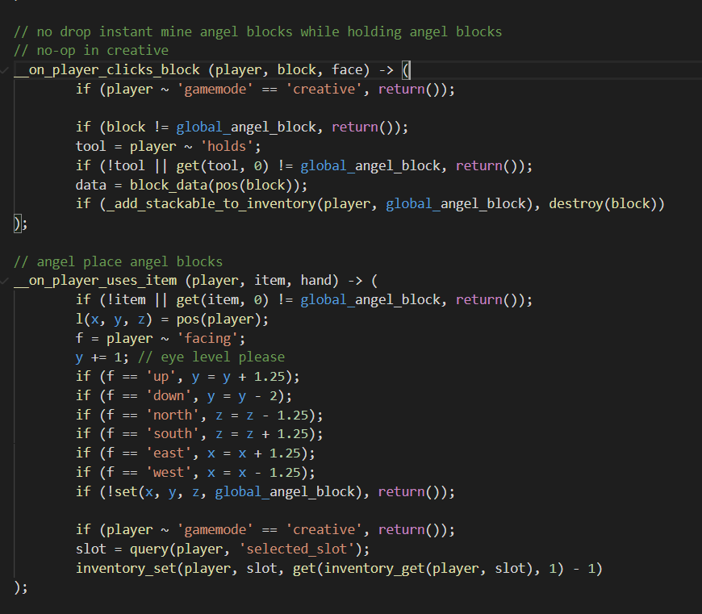
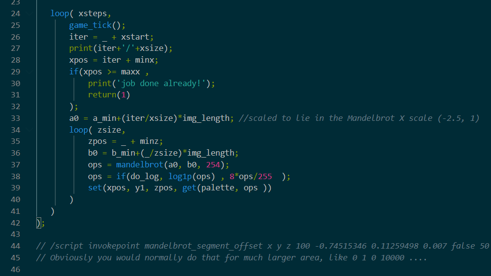
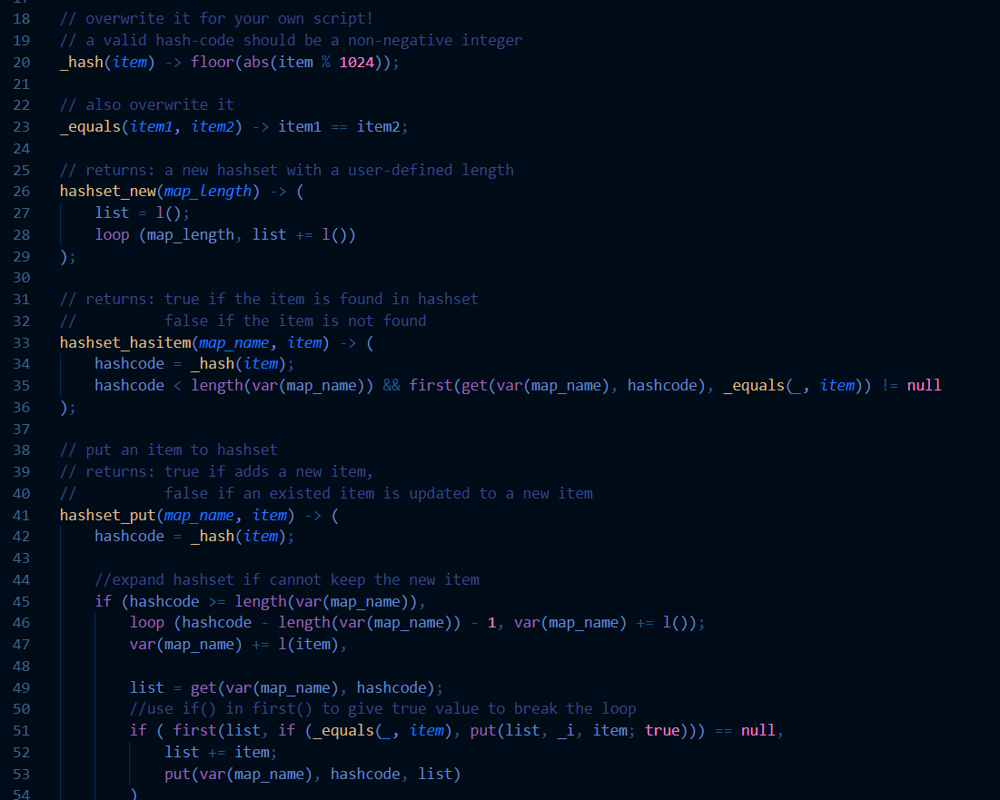

# language-scarpet
[VS Code](https://code.visualstudio.com) extension for syntax highlighting, similar to its [NPP Counterpart](https://github.com/gnembon/scarpet/tree/master/editors/notepad%2B%2B).

## Features

Currently only supports syntax highlighting. more features under way.

## Releases / Concise Changelog (Refer to CHANGELOG.MD for detailed list of changes)

### [1.0.0]
* everything ;)

### [TO-DO]
* auto-completion support
* document integration
* two additional themes that support the language